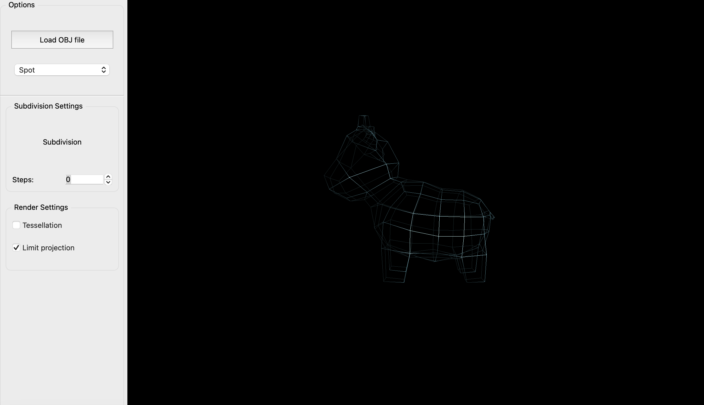

# Advance Computer Graphics Assignment 3
In this assignment catmull clark subdivision scheme is used and the application has the following functionalities:
- MA: Limit projection
- MA: Tessellation of regular patches
- B: Control tessellation levels

### Enviornment
>OPENGL 4.1
>
>QTCREATOR 6.4

To run the application, open the file CMakeLists.txt in QTCreator.

## MA: Limit projection
Limit projection feature project the vertices in a mesh (at any subdivision level) to their limit positions (i.e. the positions the vertices converge to when the number of subdivision steps goes to infinity) using limit stencils. The given class is used finds the limiting position for normal and boundary vertex:
>class LimitPositionSubdivider : public Subdivider
  
For vertices on boundary, {1/8, 3/4, 1/8} stencil is used and for non-boundary vertices, sum of average of face points and edge points is used. The results for spot model before and after limit projection is given below respectively :

       

## MA: Tessellation of regular patches
For tessellating regular patches, the first step is to find regular 3x3 patches with all the vertices of the quad valence 4. This step is done in mesh.cpp file. The index of the vertices are stored in list which is retrieved using getRegularQuadIndices() function. Next step is to get tensor product patches, which is done in the Tessellation Evaluation shader. To do this we first get the Basis functions for the given value of u,v and then taking sum of products of this basis matrix with the 16 regular patch vertex positions.

The results of regular patch tessellation for spot and brick model is given below:

       
  
## B : Control tessellation levels
All the 4 outer tessellation levels,edge wise can be changed from UI, and both the inner tessellation levels for horizontal and vertical  tessellation can also be changed from UI. The default value for outer and inner tessellation level is 4. Uniforms are used in the Tessellation Control Shader (TCS) for this purpose.

The example below for openCube model has all outer Tessellation levels 15 and both inner levels are 20. Again, these values can be changed from UI.

 

